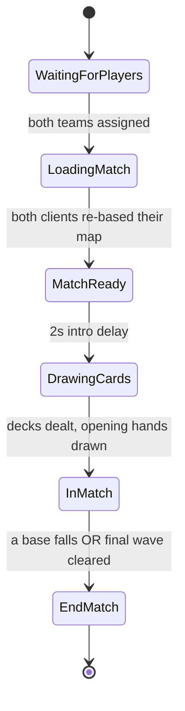
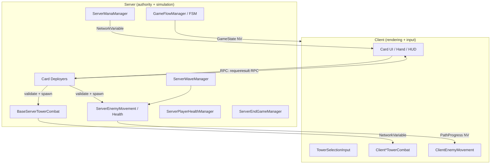
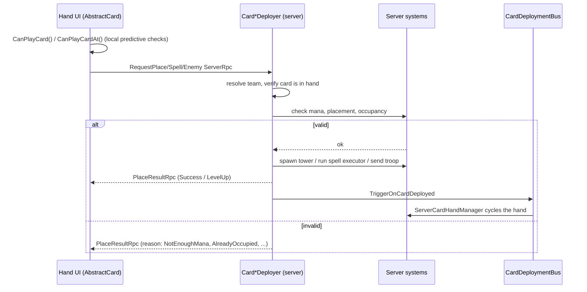

# Minimalist Defense — Multiplayer Tower Defense

> A real-time, 1v1 multiplayer tower-defense card game built in Unity with **Netcode for GameObjects**.
> Think *Clash Royale* meets *Bloons TD Battles*, dressed in clean geometric shapes: two players draw from a
> deck, spend a regenerating mana pool, and race to outlast each other against the **same synchronized
> waves** of enemies — while sabotaging the opponent with spells and troops sent straight onto their lane.

**University capstone project (TCC — PUC).**
Engine: **Unity 6000.3.11f1** · Networking: **Netcode for GameObjects 2.11** · Current build: **v1.0.5**

---

## Table of Contents

1. [What is this game?](#1-what-is-this-game)
2. [How to play](#2-how-to-play)
3. [Match lifecycle](#3-match-lifecycle)
4. [Game content](#4-game-content)
   - [Towers](#41-towers)
   - [Spells](#42-spells)
   - [Troop cards (sent to the opponent)](#43-troop-cards-sent-to-the-opponent)
   - [Wave enemies (the AI horde)](#44-wave-enemies-the-ai-horde)
5. [Core systems](#5-core-systems)
   - [Mana economy](#51-mana-economy)
   - [Deck & hand](#52-deck--hand)
   - [Wave system & fairness](#53-wave-system--fairness)
   - [Damage, armor colors & resistance](#54-damage-armor-colors--resistance)
   - [Buff & stacking system](#55-buff--stacking-system)
6. [Technical architecture](#6-technical-architecture)
   - [Client / Host / Server model](#61-client--host--server-model)
   - [Connection, lobby & authentication](#62-connection-lobby--authentication)
   - [The mirrored arena (MapTranslator)](#63-the-mirrored-arena-maptranslator)
   - [Game-flow finite state machine](#64-game-flow-finite-state-machine)
   - [Service Locator](#65-service-locator)
   - [Card deployment pipeline](#66-card-deployment-pipeline)
   - [Tower system](#67-tower-system)
   - [Enemy system & pooling](#68-enemy-system--pooling)
   - [Spell system](#69-spell-system)
7. [Project structure](#7-project-structure)
8. [Tech stack & dependencies](#8-tech-stack--dependencies)
9. [Scenes & build settings](#9-scenes--build-settings)
10. [Getting started](#10-getting-started)
11. [Extending the game](#11-extending-the-game)
12. [Coding conventions](#12-coding-conventions)
13. [Roadmap / known TODOs](#13-roadmap--known-todos)
14. [Credits & license](#14-credits--license)

---

## 1. What is this game?

Minimalist Defense is a **server-authoritative, two-player PvP tower defense**. Each player owns their own lane
(a "map"). The server spawns an **identical, synchronized sequence of enemy waves** onto both lanes at the
same time, so neither player has an easier horde. You win by being the last base standing.

The twist that makes it PvP rather than co-op: the same cards that defend you can also **attack your
opponent**. Spells like *Ice* and *Rage* are cast on the **enemy's** field, and "troop" cards spawn extra
enemies directly onto the opponent's lane to overwhelm their defenses.

**Two ways the match ends:**

| Win condition | Trigger |
|---|---|
| **Outlast** | Your opponent's base HP reaches **0** first (enemies that reach the end of a lane damage that lane's base). |
| **Survive** | You clear the **final wave** (all 10 waves defeated with no enemies left on your lane). |

Both outcomes are resolved on the server by `ServerEndGameManager`, which then freezes the simulation and
shows the end screen.

---

## 2. How to play

**Goal:** keep your base alive while your opponent's falls — by building and upgrading towers, casting
spells, and shipping troops onto their lane.

**Controls (touch / mouse):**
- **Drag a card** from your hand onto the battlefield to play it.
- **Towers** snap to the nearest valid placement node on *your* map. Drag the same tower type onto an
  existing tower to **upgrade** it (up to level 3).
- **Spells** are dropped on a target area. Some target *your* field (Fireball, Haste), others target the
  *opponent's* field (Ice, Rage).
- **Troop cards** are sent to the opponent's lane automatically.
- **Tap a placed tower** to see its range readout.

**Before you can queue:** your deck must be **full (8 cards)** — the battle screen blocks matchmaking
otherwise (`ConnectionManagerUI.CanPlay`).

**Starting a match:**
- **Create** a relay-hosted match → you receive a **join code**.
- **Join** by entering a friend's join code.

The host is also a player (peer-to-peer over Unity Relay); a dedicated-server path is scaffolded but not yet
implemented.

---

## 3. Match lifecycle

The whole match is driven by a server-side finite state machine (`GameFlowFsm`). Clients never decide
transitions — they read the replicated `GameState` and react.



| State | What happens |
|---|---|
| **WaitingForPlayers** | Server waits until both players have connected and been assigned a team (Red / Blue). |
| **LoadingMatch** | Each client repositions its local map so the player always sees themselves at the bottom (see [MapTranslator](#63-the-mirrored-arena-maptranslator)). |
| **MatchReady** | A short 2-second "get ready" beat (intro canvas). |
| **DrawingCards** | The server reads each player's deck, builds their hand, and deals the opening cards. |
| **InMatch** | The live game: mana regenerates, waves spawn, towers fire, spells resolve. **All combat is gated to this state** — outside it, towers, enemies and mana all freeze. |
| **EndMatch** | Winner resolved; simulation frozen; end-game canvas shown; each client tears down its own connection. |

---

## 4. Game content

A deck holds **8 cards**; your **hand shows 4** at a time with a "next card" preview. Cards span four
categories — Towers, Spells, Troops — across four rarities (**Common · Rare · Epic · Legendary**).

> All costs below are in **mana** (your pool refills over time and its cap grows each wave).

### 4.1 Towers

Towers are placed on nodes on **your** lane and can be upgraded to **level 3** by replaying the same tower
onto them. Stats scale per level (`Lv1 → Lv2 → Lv3`).

| Tower | Cost | Rarity | Role | Damage | Range | Cooldown (s) | Notes |
|---|---:|---|---|---|---|---|---|
| **Dart** | 2 | Common | Fast single-target | 8 / 11 / 15 | 1.1 / 1.25 / 1.5 | 0.4 / 0.35 / 0.3 | Cheap, high rate of fire. |
| **Circle** | 4 | Common | Balanced single-target | 25 / 30 / 40 | 1.25 / 1.4 / 2.0 | 1.0 / 0.9 / 0.7 | Strong scaling range at Lv3. |
| **Ground Slam** | 4 | Legendary | Heavy single-target | 10 / 20 / 35 | 1.0 / 1.0 / 1.25 | 1.2 / 1.0 / 0.85 | Big damage spikes per level. |
| **Square (Explosion)** | 6 | Rare | Area-of-effect | 35 / 45 / 50 | 1.2 / 1.3 / 1.5 | 2.5 / 2.25 / 2.0 | Splash radius 0.4 / 0.6 / 0.7; slow but hits groups. |

Each tower has a configurable **attack color** and **armor penetration** (see [armor](#54-damage-armor-colors--resistance)).
In the current balance all towers attack as **None** (true damage), so off-color resistance is dormant
headroom rather than active mitigation.

### 4.2 Spells

Spells resolve server-side through an `ISpellExecutor` after a short travel delay. A cosmetic visual is
spawned on every client, mirrored to the correct side of the field.

| Spell | Cost | Rarity | Target field | Effect | Key values |
|---|---:|---|---|---|---|
| **Fireball** | 2 | Epic | Your field | AoE burst damage to enemies on your lane | 200 dmg · radius 1.2 · 1.0s travel |
| **Haste** | 1 | Epic | Your field | Buffs **your towers'** attack speed | +25% for 5s · radius 1.2 |
| **Ice** | 4 | Legendary | Enemy field | **Freezes opponent towers** (they stop firing) | 4.5s freeze · radius 1.0 |
| **Rage** | 5 | Legendary | Enemy field | Speeds up **opponent's incoming troops** | +50% move speed · 11s · radius 1.1 · 1s linger |

Offensive/effect spells stack as independent sources: two overlapping Rage zones each add their own +50%
and expire independently (see [buff system](#55-buff--stacking-system)).

### 4.3 Troop cards (sent to the opponent)

Troop cards spawn enemies directly onto the **opponent's** lane — your offense is their tower-defense
problem.

| Card | Cost | Rarity | Sends | HP | Speed | Contact damage |
|---|---:|---|---|---:|---:|---:|
| **Triangle Player** | 2 | Legendary | Player Enemy | 250 | 2.2 | 10 |
| **Swarm** | 6 | Rare | Army Units | 120 | 2.5 | 5 |
| **Mini Boss** | 10 | Legendary | Mini Boss | 800 | 1.5 | 35 |

### 4.4 Wave enemies (the AI horde)

The scripted PvE horde both players face. **10 waves**, identical for both lanes. Enemies have an **armor
color** and **off-color resistance** (35% where armored).

| Enemy | HP | Speed | Damage | Armor | Off-color resist |
|---|---:|---:|---:|---|---:|
| **Triangle 1** | 70 | 1.2 | 2 | None | — |
| **Triangle 1 (Fast)** | 95 | 1.6 | 5 | Orange | 35% |
| **Triangle 1 (Tank)** | 250 | 1.0 | 15 | Pink | 35% |
| **Triangle 2** | 300 | 1.5 | 20 | Purple | 35% |
| **Boss** | 2000 | 0.5 | 200 | None | — |

A freshly spawned enemy is briefly **invincible and untargetable** (`SpawnDuration`) so it can't be killed
the instant it appears at the lane entrance.

---

## 5. Core systems

### 5.1 Mana economy

Mana is a shared, regenerating resource per player, fully server-authoritative.

- **Starting mana:** 3 · **Regen:** ~0.357 / second.
- **Max mana grows by wave**, creating a natural power curve:

| Wave | 1 | 2 | 3 | 4 | 5 | 6 | 7 | 8 | 9 | 10 |
|---|---|---|---|---|---|---|---|---|---|---|
| **Max mana** | 4 | 4 | 5 | 5 | 6 | 7 | 8 | 9 | 10 | 10 |

The server keeps a high-precision local float and only pushes to the `NetworkVariable` past a sync threshold
(0.1) to save bandwidth. Clients predict affordability locally (`CanAffordLocally`) for instant card
feedback, but the **server is the source of truth** (`TrySpendMana`) and can reject a play.

### 5.2 Deck & hand

`HandData` models a Clash-Royale-style cycle:

- The 8-card deck is split into an **unlocked queue** and a **locked pile** (cards whose cost exceeds the
  *current* max mana are locked out until the cap rises).
- The opening hand is drawn from a **shuffled** queue.
- **Playing a card** sends it to the back of the queue and immediately draws the next — guaranteeing a refill.
- When max mana increases each wave, newly-affordable cards are **unlocked** and shuffled into the queue
  *without disturbing the visible "next" card*.

The server owns the authoritative `HandData`; the client is told which card it drew via targeted RPCs.

### 5.3 Wave system & fairness

Fairness is a first-class design constraint. `WaveDataSO` authors waves as **min/max ranges** (enemy counts,
spawn intervals, inter-wave delays). At match start the **server rolls every range exactly once**
(`ResolveWaves`) and **both lanes run that identical resolved plan** — so the two players always face the
same enemies, counts, cadences, and timings.

- Randomness can be made **reproducible** with a fixed seed (for testing/balancing) or fresh each match.
- Each enemy line within a wave uses **its own spawn interval**, so a wave can mix a slow trickle of tanks
  with a fast burst of fodder.
- A wave ends only when its lane is cleared; clearing the **last** wave wins the match.

### 5.4 Damage, armor colors & resistance

Damage flows through one immutable value type, `DamageInfo` (amount + **attack color** + **armor
penetration**), resolved by a single pure policy, `ArmorResistance.Resolve`:

```
ArmorColor: None · Purple · Pink · Orange

• Attacker None, or armor None, or colors match  → full damage
• Colors differ                                  → damage × (1 − resistance × (1 − penetration))
```

Keeping resolution in one pure, testable function means every damage source (towers, Fireball) obeys the
same rules, and a new tower can't "forget" to carry its color — every tower funnels through
`BaseServerTowerCombat.DealDamage`.

### 5.5 Buff & stacking system

Persistent buffs use an **additive accumulator**, not a last-writer-wins multiplier, so independent sources
stack and unwind cleanly:

- **Tower attack speed** (`Haste`): `effectiveCooldown = baseCooldown / (1 + Σ buffPercent)`.
- **Enemy move speed** (`Rage`): `effectiveSpeed = base × slowMultiplier × (1 + Σ buffPercent)`.

Both keep the buff term **separate from base stats**, so a tower upgrade or a slow recomputing base speed
never wipes an active buff. Rage additionally applies a per-troop **linger** (the bonus persists N seconds
after a troop leaves the zone) and is applied **once per troop per cast** so a single zone can't self-stack.
Critically, the enemy speed change costs **zero extra bandwidth** — it rides the existing `PathProgress`
sync.

---

## 6. Technical architecture

The codebase leans hard on **SOLID** and a strict **client/server split**: server classes own simulation
and authority; client classes own rendering and input. Most systems come in a `Base*` abstract (the
contract, often a `NetworkBehaviour`) + concrete pair, registered into a global `ServiceLocator` so callers
depend on the abstraction.



### 6.1 Client / Host / Server model

`ApplicationController` bootstraps the app, detecting a headless dedicated server (no graphics device) vs a
normal player build, then instantiating a **`ClientManager`** and a **`HostManager`** (both
`DontDestroyOnLoad`). A player build can act as a pure client *or* spin up as host. `MatchServerControllers`
bundles the server-only controllers (connection approval, player-data) and is created/disposed with the host
session for clean match replays.

### 6.2 Connection, lobby & authentication

- **Authentication:** `ClientAuth` signs into Unity Authentication (anonymous, with a generated display name
  if none exists) before the Main Menu loads.
- **Hosting:** `HostManager` creates a **Relay allocation**, fetches a **join code**, opens a **Lobby**
  (heartbeated every 15s), configures the UTP transport for DTLS, and `StartHost()`s into the GameScene.
- **Joining:** `ClientManager.JoinHost(code)` resolves the relay and connects, sending the player's
  `UserData` as the connection payload.
- **Approval:** `NetworkConnectionServer.ApprovalCheck` deserializes and validates that payload, rejecting
  empty/garbage connections. On scene-load completion it raises `OnPlayerLoaded`, which the `TeamManager`
  uses to assign Red/Blue.
- **Teardown:** leaving a match is symmetric and idempotent — the host owns lobby/relay deletion and
  `NetworkManager.Shutdown()`, awaiting full stop so the next match starts clean.

### 6.3 The mirrored arena (MapTranslator)

Both players must *feel* like they're at the bottom of the screen, yet the server needs one unambiguous
coordinate space. `MapTranslator` solves this:

- The server keeps the two lanes at different world Y offsets.
- The **Blue** client re-bases its scene so it sees itself at the bottom; the **Red** client doesn't need to.
- Every cross-boundary position is converted with `LocalToServer` / `ServerToLocal`, including a
  **team-aware overload** so an *enemy-field* spell (cast on the opponent's lane) maps to the correct side.

This is why a spell visual you cast on your opponent appears on the right lane for **both** players.

### 6.4 Game-flow finite state machine

`GameFlowFsm` is a tiny, **transport-agnostic** FSM (`Dictionary<GameState, IGameFlowState>`). States read
their dependencies from a `GameFlowContext` (never the `ServiceLocator` directly) and request transitions
through a callback. `GameFlowManager` simply ticks the FSM on the server and mirrors the active state onto a
`NetworkVariable<GameState>` that the whole game reads. The FSM itself has no Unity/Netcode dependencies,
making the match flow unit-testable.

### 6.5 Service Locator

A minimal static registry (`ServiceLocator.Register/Get/Unregister<T>()`) wires the systems together.
Managers register their `Base*` type in `Awake` and unregister in `OnDestroy`, so consumers depend on
contracts, not concrete classes — and swapping in a debug/single-player implementation is a one-line change.

### 6.6 Card deployment pipeline

Playing a card is a validated, server-authoritative round trip:



- **Validation is a composable chain.** `CardValidation` (a struct carrying `IsValid` + a
  `CardInvalidReason`, with an implicit `bool` operator) lets the base `AbstractCard` own the shared mana
  check while subclasses chain extra checks (a tower needs a valid placement node; a spell does not).
- **One fan-in event.** Three concrete deployers (Tower / Spell / Enemy) emit `OnCardDeployed`; the
  `CardDeploymentBus` aggregates them into a single `OnAnyCardDeployed`, so the hand manager subscribes once
  instead of to N deployers.
- Every server check returns a **specific failure reason**, which the client turns into UI feedback.

### 6.7 Tower system

Each tower is a `TowerManager` (data + references) composed of a **server combat** and a **client combat**:

- **`BaseServerTowerCombat`** (server only) owns firing, cooldowns, leveling, freeze, attack-speed buffs, and
  damage — gated to `GameState.InMatch`. It targets via `EnemyRegistry`, preferring the enemy **furthest
  along the path** within range. Concrete variants implement `TryTriggerShot` (Circle, Square/Explosion,
  Slam, Dart).
- **`BaseClientTowerCombat`** (client only) subscribes to the server's `NetworkVariable`s (level, frozen,
  hasted) and raises C# events to drive GFX, range indicators, and bullet visuals — no gameplay logic.

State that matters to visuals (level, frozen, hasted) is replicated as `NetworkVariable`s; everything else
stays server-private.

### 6.8 Enemy system & pooling

- **`ServerEnemyMovement`** advances a normalized `PathProgress` along a `WaypointPath` each tick and
  replicates only that single float (past a threshold). Clients reconstruct the visual position from it —
  extremely bandwidth-cheap. Reaching the end damages that lane's base and despawns.
- **`EnemyManager`** composes movement, health, team, and path-assignment behind one façade.
- **`EnemyNetworkPool`** implements NGO's `INetworkPrefabInstanceHandler` to **recycle** enemy
  `NetworkObject`s instead of Instantiate/Destroy churn — important for mobile. Handlers are carefully
  removed on teardown to avoid stale references leaking across matches.
- **`EnemyRegistry`** is a shared list of live enemies that towers and spells query for targeting.

### 6.9 Spell system

Spells are pure server-side behaviors selected by a factory:

- **`SpellExecutorFactory`** maps `SpellType → ISpellExecutor` (Fireball, Ice, Haste, Rage).
- Each executor receives a `SpellExecutionContext` (position, caster team, data SO, a coroutine runner) and
  runs its effect after the spell's travel time.
- Effects read live `EnemyRegistry` / `TowerRegistry` and filter by team so enemy-field spells never hit the
  caster's own units. Data lives in `SpellDataSO` subclasses (`SpellOffensiveDataSO`, `SpellEffectDataSO`,
  `SpellRageDataSO`).

---

## 7. Project structure

```
Assets/
├── Scripts/
│   ├── ApplicationController/     # App bootstrap; Client / Host / Server managers
│   ├── Components/                # Shared components (TeamIdentifier, …)
│   ├── Debug/                     # Debug hands, single-player test services, debug HUD
│   ├── Gameplay/
│   │   ├── Camera/                # CameraSlide
│   │   ├── CardHand/              # Server hand manager, HandData (deck/draw cycle)
│   │   ├── Cards/                 # AbstractCard, validation, deployers, spells, towers, enemies
│   │   │   ├── Card/              #   Base card, CardValidation, GFX, UI factory
│   │   │   ├── Deployers/         #   Tower/Spell/Enemy deployers + CardDeploymentBus
│   │   │   ├── Spells/            #   SpellCard, executors, executor factory, data SOs
│   │   │   ├── Tower/             #   TowerCard, ghost preview, placement feedback
│   │   │   └── Enemy/             #   SpawnEnemyCard
│   │   ├── Combat/                # DamageInfo, ArmorResistance
│   │   ├── EndGameManager/        # Winner resolution & snapshot
│   │   ├── Enemies/               # Server/Client movement & health, registry, pooling
│   │   ├── GameFlow/              # FSM, context, states
│   │   ├── Mana/                  # Server/Client mana managers, settings
│   │   ├── Map/                   # Map settings
│   │   ├── Placeables/            # Tower placement nodes
│   │   ├── PlayerHealth/          # Base HP manager
│   │   ├── Towers/                # Server/Client combat, registry, data SOs, bullets
│   │   └── Waves/                 # Wave manager + WaveDataSO (ranged, server-rolled)
│   ├── Loader/                    # Scene loading (incl. networked scene load)
│   ├── Networking/                # MapTranslator, Teams, network map position
│   ├── ServiceLocator/            # Static service registry
│   ├── Services/                  # Server authentication & players-data manager
│   ├── UI/                        # Menu (battle/deck/shop pages) + in-game HUD (Shapes)
│   ├── UnityServices/             # Relay/Lobby connection UI
│   └── Utils/                     # GameLog
├── ScriptableObjects/            # All balance data: cards, towers, enemies, spells, waves, settings
├── Prefabs/                      # Towers, enemies, spells, cards, map, UI, particles, bullets
├── Scenes/                       # StartScene, AuthBootstrap, MainMenu, Loading, GameScene, NoNetwork
├── Sprites / Animations / Shaders / Font / Settings
└── (3rd-party) Feel, Shapes, KecekPlugins, CrystalFramework, QFSW Quantum Console, …
```

`Base*` abstract + concrete pairing is the dominant pattern; balance lives entirely in ScriptableObjects so
designers tune the game without touching code.

---

## 8. Tech stack & dependencies

| Area | Tooling |
|---|---|
| **Engine** | Unity **6000.3.11f1** (URP, 2D) |
| **Networking** | Netcode for GameObjects 2.11 · Unity Transport (UTP/DTLS) · Relay · Lobby · Multiplayer Services |
| **Multiplayer dev** | Multiplayer Play Mode, Multiplayer Tools, Dedicated Server package |
| **Pathfinding** | A* Pathfinding Project (`AstarPathfindingProject`) |
| **Editor / inspector** | **Odin Inspector** (Sirenix) — `[Title]`, `[Required]`, `[ShowIf]`, ranged inspectors |
| **Tweening / juice** | **DOTween** · **Feel / MoreMountains** (MMFeedbacks) · Nice Vibrations (haptics) |
| **Vector UI** | **Shapes** (Freya Holmér) — immediate-mode rounded panels, bars, frames on Canvas |
| **Input** | Unity Input System |
| **Debug / QoL** | QFSW Quantum Console · Advanced FPS Counter · Hierarchy Focused Debug Console · vFolders/vHierarchy/vTabs · Hot Reload |
| **IAP** | Unity Purchasing (scaffold) |
| **Target platforms** | Mobile (iOS / Android), 2D PvP |

Performance posture: clients target **180 FPS** (vSync off); a dedicated-server build targets **60**.

---

## 9. Scenes & build settings

Build scene order (`EditorBuildSettings`):

1. **StartScene** — entry point.
2. **AuthBootstrap** — Unity Services + authentication.
3. **MainMenu** — Battle / Deck / Shop pages; deck building & matchmaking.
4. **Loading** — transition scene; `Loader` resumes the target load on completion.
5. **GameScene** — the actual match.
6. **NoNetwork** — fallback when services are unavailable.
7. **Unit Tests / Tower / 01_Tower_Placement** — an isolated tower-placement test scene.

Scene flow is centralized in the static `Loader`, which handles plain loads, **host networked** loads
(`NetworkManager.SceneManager`), and the client connect-on-load handshake.

---

## 10. Getting started

> ⚠️ This is a private university project; third-party paid assets (Odin, Feel, Shapes, Hot Reload, …) are
> required to compile and are not redistributable. You need a Unity account with those assets to open the
> project as-is.

**Prerequisites**
- Unity **6000.3.11f1** (install via Unity Hub; match the exact patch version).
- A **Unity Gaming Services** project (for Authentication, Relay, Lobby) linked in
  *Project Settings → Services*.
- The licensed third-party packages listed above present under `Assets/`.

**Open & run in the Editor**
1. Clone the repo and open the root folder in Unity Hub with the matching editor version.
2. Let the editor import packages and compile.
3. Open `Assets/Scenes/StartScene.unity` and press **Play**.

**Testing multiplayer locally**
- Use the **Multiplayer Play Mode** package (already a dependency) to launch a second virtual player, or make
  a standalone build for the second client.
- One side **Creates** a relay match (copy the join code from the logs/UI); the other **Joins** with that
  code. Remember: **both decks must hold 8 cards** to queue.
- For solo iteration there are **debug services** under `Assets/Scripts/Debug/Services/` (single-player
  players-data, debug wave/end-game managers) and **debug hands** (`DEBUG_Hand_OnlyTowers`,
  `DEBUG_CardHandSettings`) plus an **endless mana** profile for sandbox testing.

**Making a build**
- Standard Unity build for your target mobile platform. The `ApplicationController` auto-detects headless
  (dedicated-server) vs player builds at runtime.

---

## 11. Extending the game

The card pipeline is deliberately uniform, so adding content is mostly **data + one prefab + registration**:

**To add a new card** (tower, spell, or troop), the moving parts are:
1. A `CardType` enum entry.
2. A `CardDataSO` subclass **asset** (`TowerCardDataSO` / `SpellCardDataSO` / `SpawnEnemyCardDataSO`) with
   cost, rarity, art, description.
3. The **card prefab** (UI) and the **gameplay entity**:
   - *Tower* → tower prefab + `Server*/Client*TowerCombat` pair + `TowerDataSO`.
   - *Spell* → an `ISpellExecutor` + entry in `SpellExecutorFactory` + a `SpellDataSO` subclass.
   - *Troop* → enemy prefab + `EnemyDataSO`.
4. Registration into the list SOs (`_CardDataListSO`, `_TowerDataListSO`, `_EnemyDataListSO`,
   `SpellDataListSO`) and Netcode's `DefaultNetworkPrefabs`.
5. Add it to a deck for testing.

This repo ships a **`create-card` authoring skill** that walks the entire pipeline end-to-end through the
Unity MCP bridge — ask for "add a card" to drive it interactively.

**To add a new wave layout:** author a `WaveDataSO` with ranged enemy counts/intervals — the server rolls and
mirrors it automatically.

**To add a new tower attack color / armor interaction:** extend the `ArmorColor` enum and set colors on the
relevant `TowerDataSO` / `EnemyDataSO`; `ArmorResistance.Resolve` already handles the math.

## 12. Coding conventions

- **`Base*` abstract + concrete** for every networked system; register the abstract in `ServiceLocator`.
- **Server owns truth, client owns pixels.** Server `NetworkBehaviour`s `enabled = false` themselves on
  non-server peers; client combats disable on dedicated servers.
- **Replicate the minimum.** Sync one normalized float (`PathProgress`) instead of transforms; gate
  `NetworkVariable` writes behind thresholds.
- **ScriptableObjects for all balance.** No magic numbers in gameplay code.
- **Composable validation** via small structs (`CardValidation`, `SpellValidation`, `TowerValidation`)
  carrying typed failure reasons for UI feedback.
- **Events over polling** for cross-system reactions (`CardDeploymentBus`, FSM `OnStateChanged`,
  health/wave/end-game events).
- Logging goes through `GameLog` (toggleable for builds).

## 13. Roadmap / known TODOs

Surfaced directly from the code:
- **Dedicated server** path is scaffolded (`ApplicationController`, `ConnectionManagerUI` buttons,
  Dedicated Server package) but not yet implemented.
- **Trophies & rewards** after a match are stubbed (`ServerEndGameManager` notes the hook;
  trophies are currently random placeholder values).
- **Shop / progression** pages exist in the menu as scaffolding.
- IAP (`Unity Purchasing`) is present but not wired into gameplay.

## 14. Credits & license

**Academic context.** Developed as a **TCC (Trabalho de Conclusão de Curso)** at **PUC**, exploring
SOLID architecture and scalable, server-authoritative multiplayer design with Netcode for GameObjects.

**Third-party assets** retain their respective licenses and are **not** covered by this project's terms:
Odin Inspector (Sirenix), Feel/MoreMountains, Shapes (Freya Holmér), DOTween (Demigiant), A* Pathfinding
Project, QFSW Quantum Console, Nice Vibrations (Lofelt), Advanced FPS Counter, Hot Reload, and the Unity
packages listed above. Do not redistribute these assets.

**License.** No open-source license is granted for the original project code at this time (all rights
reserved by the authors). Contact the maintainers before reuse.

---

*Generated as a comprehensive overview of the codebase as of build v1.0.5. Balance values are read directly
from the project's ScriptableObjects and may change as the game is tuned.*
